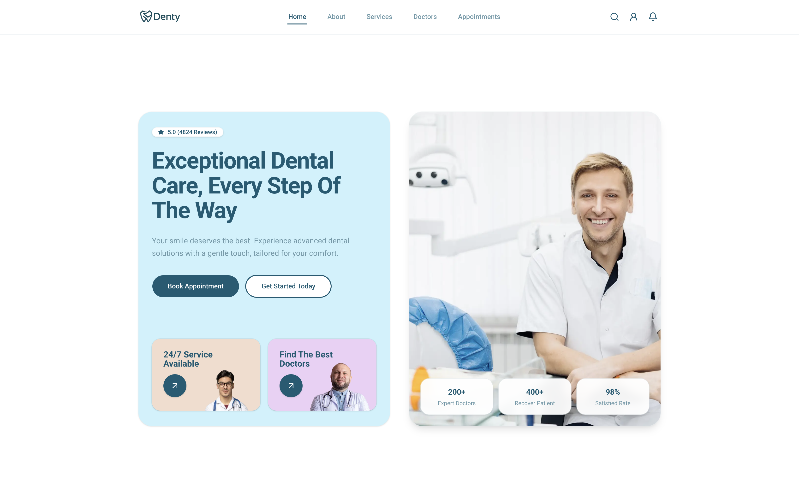

# Denty

Marketing site for **Denty**, a dental care brand. The app is a single-page landing experience built with **Next.js** (App Router), **TypeScript**, and **Tailwind CSS**, using **shadcn/ui**-style components for layout and UI primitives.

## Live demo & preview

**Production:** [https://denty-bd.vercel.app/](https://denty-bd.vercel.app/)



## Features

- Responsive layout with section-based composition (hero, about, services, team, testimonials, CTA).
- Sticky header with in-page navigation and smooth scrolling to anchors.
- Light theme only; brand colors are expressed as CSS variables in `src/app/globals.css`.

## Tech stack

| Area        | Choice |
|------------|--------|
| Framework  | Next.js 16 (App Router) |
| UI         | React 19, Radix primitives via shadcn |
| Styling    | Tailwind CSS v4 |
| Icons      | Lucide React, react-icons (where brand icons are needed) |
| Tooling    | TypeScript, ESLint (Next config) |

## Prerequisites

- **Node.js** 20+ (recommended), or a compatible runtime
- **Bun** (optional; used in this repo for installs and scripts)

## Getting started

Install dependencies:

```bash
bun install
```

Run the development server:

```bash
bun dev
```

Open [http://localhost:3000](http://localhost:3000) in your browser.

Equivalent commands work with `npm`, `pnpm`, or `yarn` if you prefer.

## Scripts

| Command   | Description |
|-----------|-------------|
| `bun dev` | Start the dev server with hot reload |
| `bun run build` | Production build |
| `bun run start` | Run the production server locally |
| `bun run lint` | Run ESLint |

## Project structure (high level)

```
src/
  app/           # App Router: layout, global styles, pages
  components/    # UI primitives, layout (header/footer), marketing sections
  data/          # Copy and nav configuration for the landing page
  lib/           # Shared utilities (e.g. smooth scroll helpers)
public/          # Static assets (logos, images referenced by URL)
```

Landing content and navigation labels for the home page are centralized in `src/data/home-content.ts` where practical, so copy updates do not require hunting through every component.

## Styling and design tokens

Brand colors and related tokens are maintained in **`src/app/globals.css`** (`:root` and `@theme inline`). If you maintain a separate token file locally, keep it aligned with those variables when changing the palette.

## Deployment

This is a standard Next.js static-friendly app suitable for hosting on [Vercel](https://vercel.com) or any platform that supports Node.js builds. See the [Next.js deployment documentation](https://nextjs.org/docs/app/building-your-application/deploying) for environment and build output details.

## License

Private project unless otherwise stated by the repository owner.
